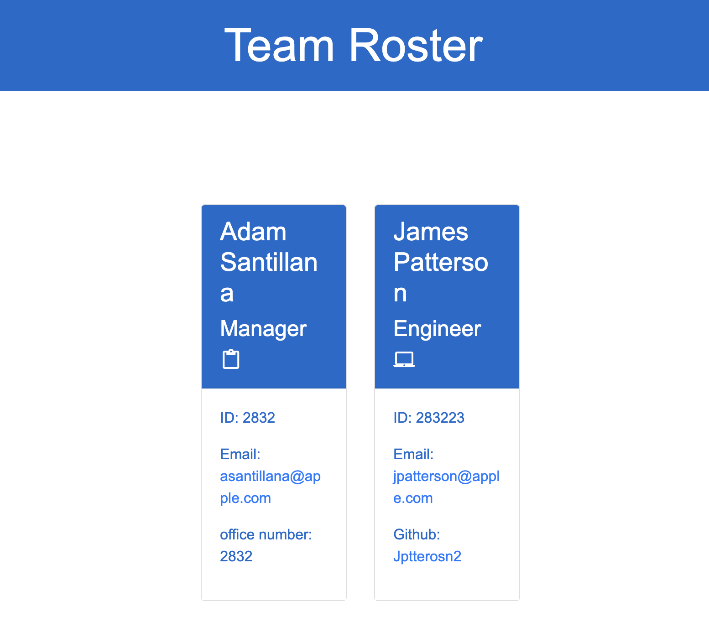

# Team Roster Generator  

## Description
This project uses the command-line interface to receive input regarding the members of a team and creates a corresponding HTML page based on the input.
## Table of Contents:
* [Installation](#installation)
* [Usage](#usage)
* [License](#license)
* [Contributing](#contributing)
* [Tests](#tests)
* [Questions](#questions)
### Installation:
This project uses the following dependencies:
```Open a terminal in the directory and run 'npm i' to install the required dependencies. ```
### Sample Image:

### Usage:
When you are ready to use the tool, run 'node index.js' and follow the prompts in the terminal.
### License:
This project is licensed under:
MIT License
### Contributing:
This project is open source and able to be used however you like.
### Tests:
In order to test open the console and run the following:
```To test the project, run npm test and follow terminal output for test results.```
### Questions:
If you have any questions contact me on [GitHub](https://github.com/adam42288) or email 
me at a75052@gmail.com  
 